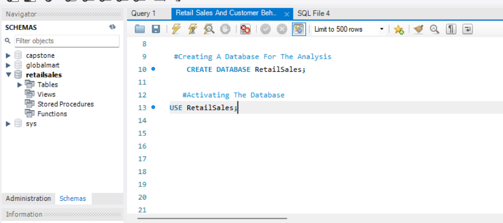
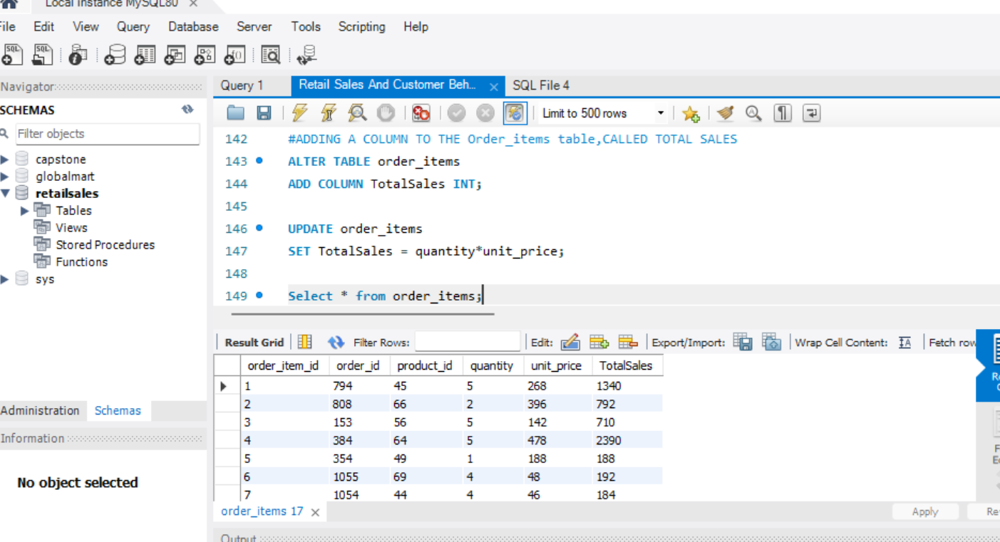
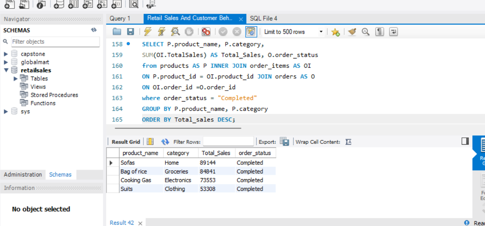
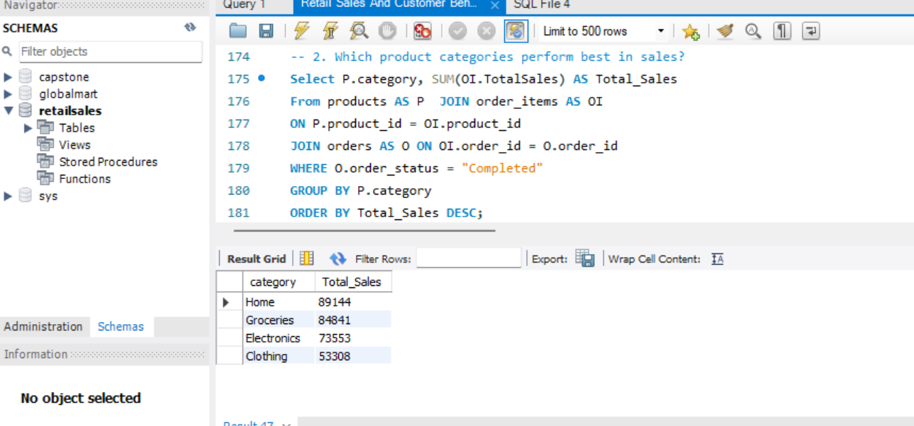
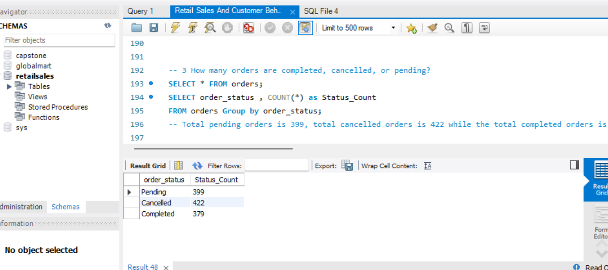
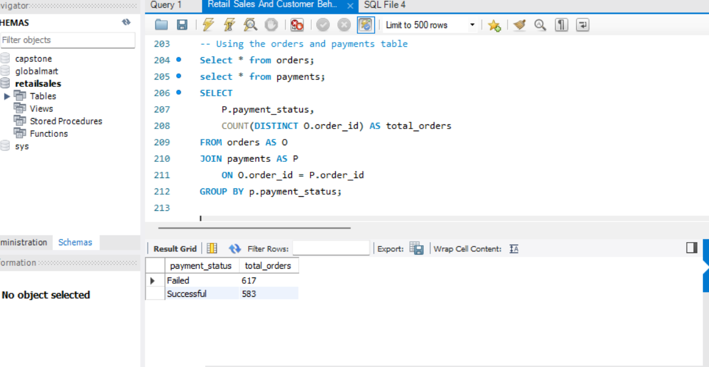
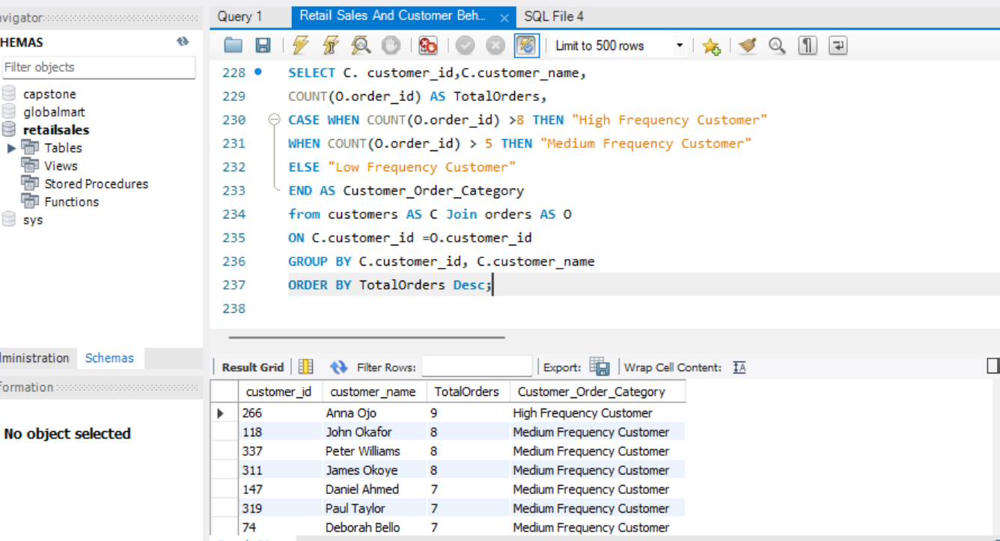
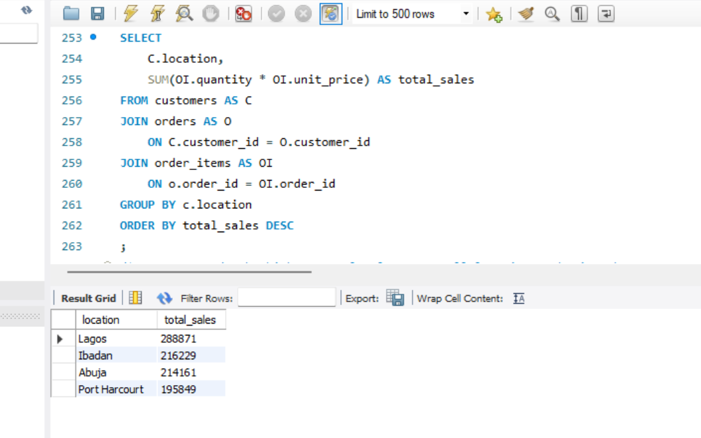

# Retail-Sales-And-Customer-Behaviour-Analysis
## Introduction
RetailMart is an online retail business operating across multiple locations. While overall sales performance appears healthy, management seeks deeper insights into customer behaviour, sales trends, and operational challenges that may be impacting revenue and growth of the organization.
This project is to help RetailMart uncover meaningful insights that support better decision-making.

 # Business Objectives
 
The main objectives of this analysis are to:

- Understand customer purchasing behaviour
- Evaluate overall sales performance across locations
- Identify reasons behind order cancellations and failed payments
- Segment customers to identify low-value customers

  
## Problem Statement 
This analysis aims to answer the following questions:

- What percentage of orders are cancelled, and why?
- What factors contribute to failed payments?
- Who are the High-value customers, and how often do they purchase?
- Which products perform best and worst across locations?
- How does customer behaviour differ by location and product category?

## Data Sourcing  
- **Data source:** RetailMart database
- **Time period:** 2 Years (betweeen 2024 to 2025)
- **Number of records:** 5 Key Tables
   - Customer table
   - Orders table
   - Order details table
   - Payments table
   - Products table

## Key fields 
  - Customer ID
  - Customer name
  - Gender
  - Age
  - Location
  - Order ID
  - Product ID
  - Product Category
  - Quantity
  - Unit Price
  - Total Amount
  - Order Status (Completed, Cancelled, Pending)
  - Payment Method
  - Payment Status
  - Transaction Date

## Data Transformation & Cleaning 
The following steps were performed before analysis
  - Creating a database to house the data in sql
  - Importing the data with the table import wizard
  - Creating a backup for the data
  - Checking for nulls
  - Created derived metrics such as total sales
    
** Below is the image of the Created database to host the tables in SQL and the created column after importing all the tables into SQL**

# Insights & Findings 

## Insight 1
### Highest performing product:
Sofas generated the highest total sales of 89,144 from other products, while other products like bag of rice,Suits and Cooking gas  also has potential, but the highest grossing product is sofas from the home category
**NOTE** Only the **Completed** Sales is being calculated for this analysis

## Insight 2
### Product performance by category (Completed orders only)
The best performing product category for the completed orders is the home category with 89,144 total completed sales

## Insight 3
### Order Status Distrubution
Analysis of the orders table shows a noticeable imbalance across order statuses:
 - Cancelled orders: 422
 - Pending orders: 399
 - Completed orders: 379

Cancelled orders represent the largest share of total orders, exceeding completed orders. This suggests potential issues in the order fulfillment or payment process that may be contributing to revenue loss.
A high number of pending orders also indicates possible delays in payment confirmation or order processing, which could negatively affect customer experience if not resolved promptly.

## Insight 4
### Effect Of Failed Payment On Order Completion
The analysis shows that failed payments have a significant impact on order completion. Out of the total orders analyzed, 617 orders had failed payments compared to 583 orders with successful payments. This indicates that more than half of the orders were not completed due to payment failures.
 As a result, failed payments directly reduce the number of completed orders and negatively affect overall sales performance. Improving payment success rates could therefore lead to higher order completion and increased revenue

## Insight 5
### Highest Frequency Customer
The analysis identifies customers based on the total number of orders placed and categorizes them using order frequency levels. Customers are grouped into High Frequency, Medium Frequency and Low Frequency categories based on their ordering behavior.From the results, Anna Ojo is the highest-ordering customer with 9 orders, placing her in the High Frequency Customer category. 
 This indicates a strong level of customer loyalty and repeat purchasing behavior
 

## Insight 6
### Geographical Analysis
Lagos generated the highest sales, identifying it as a strong performing market. This suggests that targeted marketing campaigns, enhanced logistic efficiency and inventory priortization in high performing locations can improve business performance. Also lower performing locations may require tailored growth strategies to increase brand awareness and improve sales

## Key Insights
  - Order cancellations account for a significant portion of revenue loss
  - Failed payments are more common with specific payment methods
  - A small group of customers contributes most of the revenue
  - Several customers show low purchase frequency and low monetary value
  - Certain products consistently underperform across locations

 ## Recommendations
Based on the analysis, the following recommendations are proposed:
 - Improve payment gateway reliability for high-failure methods
 - Introduce targeted promotions for low-value customers
 - Optimize or discontinue underperforming products
 - Investigate root causes of order cancellations at specific locations

## Conclusion
This analysis reveals that while RetailMart generates strong sales from key products and categories—particularly sofas within the home category—overall business performance is significantly affected by operational challenges. High levels of order cancellations and failed payments are reducing the number of completed orders and limiting revenue realization.
Customer analysis shows that a small group of high-frequency customers contributes disproportionately to total orders, while many customers demonstrate low purchase frequency and value. This presents both a retention opportunity and a risk if loyal customers are not properly engaged.
Overall, the findings highlight the need for improved payment reliability, better order processing, and more targeted customer and product strategies to convert strong demand into consistent revenue growth

## Key Skills Demonstrated
- SQL querying and joins
- Data aggregation and filtering
- Business-driven analysis
- Problem-solving using data
- Documentation and reporting

  
## Author
**Olatunbosun Fikayo**

**Junior Data Analyst | Excel | SQL | Power BI**

This project is part of my data analytics learning journey, where I document hands-on projects and share insights publicly.

